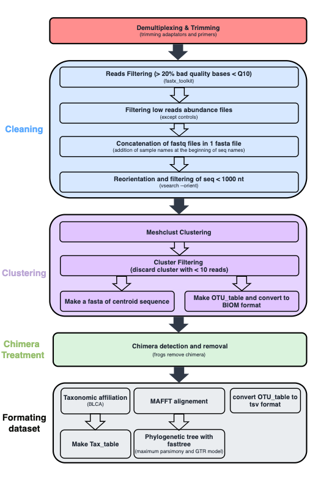

# Microbial profiling of native and alien Drosophila in French Guiana - User Guide

Invasive alien species (IAS) represent a major threat to biodiversity, human health, and economy. Yet the role of host-associated microbiomes in invasion processes remains poorly understood in natural systems. Here, we investigated the bacterial and fungal microbiomes of IAS and native Drosophila species collected along an anthropization gradient in French Guiana. 

## Data Availability

Data are available on the European Nucleotide Archive (ENA) under the study accession number **PRJEB112398**. 

The dataset contains:
- **Pooled samples**: Sequenced for 16S and ITS markers
- **Single-fly samples**: Sequenced for COI (Cytochrome Oxidase I)

This repository has been structured so that its main components can be used independently. As a result, you can skip any section that is not of interest to you.

## Getting Started

1. Download the repository `Microbial-profiling-of-native-and-alien-Drosophila-in-French-Guania` from GitHub.
2. Download the raw sequencing data from ENA (PRJEB112398).
3. Add the sequencing data files to the main folder.
4. In a terminal run the moving_data_script.

# Drosophila Community Analyses

COI Typing of Drosophila from raw reads to statisical analyses

Open the folder `Drosophila_community_analyses`

## Step 1: Run Bioinformatic Processing

In a terminal, Run `COI_Bioinformatic` to preprocess the raw sequencing data.

## Step 2: Prepare Data for Taxonomic Affiliation

On R studio, Run the R Markdown script `Creating_excel_COI_reads.Rmd`, to prepare and format the COI data

**Output:** Creates formatted Excel files and FASTA sequences ready for BLAST analysis.

## Step 3: Perform Taxonomic Affiliation

On R studio, Run the R Markdown script `COI_Blast.Rmd` in order to BLAST COI sequence against NCBI database.

**Output:** Produces taxonomic assignments and identifies potential contaminations in pooled samples (important for microbiome analysis).

## Step 4: Statistical Analyses and Visualization

On R studio, Run the R script `Typing_Drosophila_results.R` to generate statistical analyses, figures, and publication-ready results.

**Outputs include:**
- Part of the Graphical abstracts (py chart of Drosophila distribution)
- Species composition by locality
- Statistical tests (Chi-squared, Fisher's exact test)
- Distribution maps of Drosophila species in French Guiana

# Drosophila microbiome Analyses

Bacterial 16s rRNA and ITS metaborcoding of pooled Drosophila from raw reads to statisical analyses

Come back to main folder and open the folder `Microbiome_analyses`.
In a terminal run Sequence_moving_script.

**WARNING:** for step 1 and 2 need a good computer.

## Mandatory package 

### BioInformatic

1. drosobiome2025 (environement conda): vsearch, fastx_toolkit, python 3.11.14, BLAST+, BLCA, MAFFT and FastTree.
2. meshclust (environement conda): meshclust v3 (need to be install via Identity)
3. biom_env (environement conda):  biom-format
4. frogs_env (environement conda): frogs

### Rstudio packages

DESeq2
PMCMRplus
RColorBrewer
VennDiagram
ape
breakaway
car
coin
cowplot
devtools
dplyr
ggh4x
ggnewscale
ggpattern
ggplot2
ggplotify
ggpubr
ggrepel
ggtext
grid
gridExtra
magrittr
matrixcalc
microbiome
openxlsx
pairwiseAdonis
patchwork
phangorn
phyloseq
phytools
purrr
ranacapa
readr
readxl
remotes
reshape2
rstatix
scales
stringr
tibble
tidyr
tidytext
tidyverse
usedist
vegan
viridis
writexl

## Step 1: Bacterial 16s rRNA Bioinformatic

1. Open the folder `bacterial_16s_rRNA_metabarcoding`
2. In a terminal run `Pipeline_part1`
3. In Rstudio run Stats_N_reads.R
4. In a terminal run `Pipeline_part2`
   

## Step 2: Fungal ITS Bioinformatic

**Note:** The ITS pipeline is the same than the 16s pipeline but without the tree building steps.

1. Open the folder `Fungi_ITS_metabarcoding`
2. In a terminal run `Pipeline_part1`
3. In Rstudio run Stats_N_reads.R
4. In a terminal run `Pipeline_part2` 

**Note:** For next step you will need `16s_OTU_table_without_chim.tsv`, `16s_metadata.csv`, `16s_tax_table_without_chim.tsv`,`centroids.tre`, `OL4_OTU_table_without_chim.tsv`, `OL4_metadata.csv` and `OL4_tax_table_without_chim.tsv`. If you skipped Bioinformatic part you will find this files in the compressed archive `Bio_informatics_results_file.zip`.

### Step 3: Statistical analyses.

If you skipped Bioinformatic part pleas unzip `Bio_informatics_results_file.zip`.
If you perform Bioinformatic part move `16s_metadata.csv`, `16s_OTU_table_without_chim.tsv`, `16s_tax_table_without_chim.tsv`, `centroids.tre`, `OL4_metadata.csv`, `OL4_OTU_table_without_chim.tsv` and `OL4_tax_table_without_chim.tsv` into the folder `Microbiome_analyses`.

Next steps will be done on Rstudio.

1. Come back to `Microbiome_analyses` folder.
2. Run `1-Control+Phyloseq.Rmd`, this script allow to prepare the phyloseqs object for analyses. 
3. RUN `2-Alpha_diversity.Rmd`, this script allow to calculate alpha diversity indexes and to statistically compare the diversity accross Locality, HostSpecies and Invasion statut.
4. Run `3-Ordination.Rmd`, this script allow to represent and compare statically the structure and the composition of the microbiome accross Locality, HostSpecies and Invasion statut.
5. Run `4-Investigating_on_OTUs(unknow_treatment_version).Rmd`, this script allow the detection of taxa exclusive too Invasive alien Drosophila or Native species. 
6. Run `4.1-Class_relative_abundance`, this script allow the description of bacteria and fungi class distribution accross Locality, HostSpecies and Invasion statut.
7. Run `4.2-Pool_investigation.Rmd`, this script clarify pool composition for the pool with a suspect class composition.
8. Run `5-Core_microbiome.Rmd`, this script allow to describe core microbiome compoistion and to identify taxa unevenly distributed between Invasive alien Drosophila and Native Drosophila.
9. Run `6-comparison.Rmd`, this script allow comparison of the data first with excluded data in order to verify if mistake was made and then to reference dataset. The reference dataset is build with Staubach et al. (2013), Wang et al. (2020), and Brown et al. (2023) dataset.

**Note:** The file `Miss_identify_sample.xlsx`is a results of COI analyses. 

